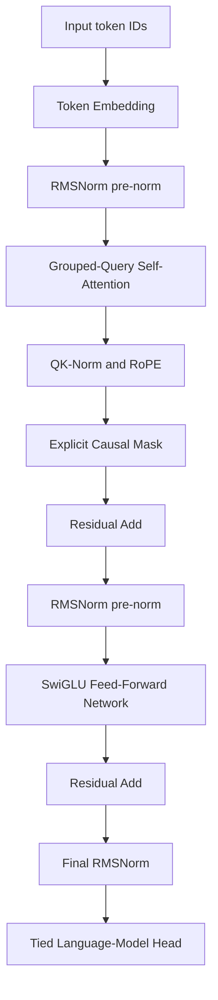

# My-MiniGPT

<p align="center">
  <a href="https://huggingface.co/spaces/ianhaimo/GPT-A-Minimal-Interpretable-Implementation">
    
  </a>
</p>

A ground-up PyTorch implementation focusing on attention mechanics, masking, normalization design choices, bilingual data preparation, and memory-aware language-model training.

The current default is a **254,450,944-parameter (approximately 254.5M)** bilingual English-Simplified-Chinese model. Its primary training direction is **literary language ability in both English and Simplified Chinese**: long-form narrative, description, dialogue, style, and coherent continuation. Educational and general-knowledge data provide a foundation, while curated books and literary corpora remain central to the model's identity.

## Primary Training Focus

My-MiniGPT is designed first as a bilingual literary language model rather than an instruction-following assistant. Pretraining emphasizes:

- English and Simplified-Chinese literary prose;
- long-form narrative continuity, scene description, and dialogue;
- exposure to both classic and modern literary styles;
- balanced bilingual tokenization and data preparation;
- transparent, ground-up PyTorch implementations that keep the model's behavior inspectable.

The educational, mathematical, scientific, and general-text sources in the mixture support vocabulary and world knowledge, but the main qualitative target is literary generation in both languages.

## Project Motivation

Most Transformer tutorials rely heavily on high-level PyTorch modules, which obscures critical design details such as attention masking, normalization placement, tensor reshaping across heads, and the exact state required to resume training.

This project rebuilds a decoder-only [Transformer](https://arxiv.org/abs/1706.03762) from the ground up to make its internal mechanics and trade-offs directly inspectable. The implementation deliberately keeps explicit Q/K/V projections, head reshaping, Rotary Position Embeddings (RoPE), causal masking, attention score computation, residual connections, normalization, feed-forward routing, and quantization simulation instead of hiding them behind `nn.MultiheadAttention` or a high-level training framework.

The current default is a roughly 254.5M-parameter bilingual English-Simplified-Chinese model intended for serious pretraining experiments while remaining readable and debuggable on a single GPU. The training configuration uses a two-sample micro-batch and 32-way accumulation, preserving the previous 32,768 effective tokens per optimizer step while reducing host-to-device starvation.

## Architecture Overview



The requested shared-K/V multi-head design is implemented as [**Grouped-Query Attention (GQA)**](https://arxiv.org/abs/2305.13245). Query heads remain independent, while fewer key/value heads are shared across query groups. Changing only `n_kv_heads` allows the same implementation to express MHA, GQA, or MQA:

```text
Q: [batch, n_heads,    time, head_dim]
K: [batch, n_kv_heads, time, head_dim]
V: [batch, n_kv_heads, time, head_dim]

n_kv_heads == n_heads  -> Multi-Head Attention (MHA)
1 < n_kv_heads < n_heads -> Grouped-Query Attention (GQA)
n_kv_heads == 1 -> Multi-Query Attention (MQA)
```

### Default Model

| Component | Default |
|---|---:|
| Parameters | 254,450,944 |
| Vocabulary | 50,304 tokens |
| Transformer blocks | 18 |
| Model dimension | 1,024 |
| Query heads | 16 |
| Key/value heads | 4 |
| Head dimension | 64 |
| Feed-forward hidden dimension | 2,816 |
| Maximum context length | 1,024 tokens |
| Main training context | 512 tokens |
| Normalization | Pre-RMSNorm plus QK-Norm |
| Position encoding | RoPE |
| Feed-forward network | SwiGLU |
| Output head | [Weight-tied token embedding](https://arxiv.org/abs/1608.05859) |

The default configuration is in [`configs/model_small.json`](configs/model_small.json).

## Key Implementations & Trade-offs

### 3.1 Manual Attention Masking

Instead of relying on PyTorch's built-in causal attention, the model explicitly computes scaled Q/K scores, constructs the upper-triangular causal mask, applies the mask before softmax, and multiplies the resulting probabilities by V. Attention softmax is accumulated in FP32 for numerical stability.

### 3.2 RMSNorm and Pre-Normalization

The original LayerNorm comparison was useful for understanding centering and variance normalization. The current model uses a ground-up [RMSNorm](https://arxiv.org/abs/1910.07467) implementation in a pre-normalization layout. RMSNorm avoids mean subtraction and provides a simpler normalization path that is common in modern decoder-only language models. The same operation is applied independently to each Q and K head before RoPE; this is per-head RMS normalization, not the L2-normalized, learnable-temperature formulation from the separate QKNorm paper.

### 3.3 Grouped-Query Attention Reshaping

The embedding dimension is explicitly reshaped into `(num_heads, head_dim)`. Sixteen query heads are paired with four key/value heads, so each K/V head serves a group of four query heads. This retains multiple query subspaces while reducing K/V projection parameters and inference-time KV-cache size relative to full MHA.

GQA does not remove the quadratic training cost of the full `QK^T` attention matrix. It primarily reduces K/V parameters, bandwidth, and cache size.

### 3.4 Rotary Positional Embeddings (RoPE)

- **Relative position behavior:** [RoPE](https://arxiv.org/abs/2104.09864) rotates pairs of query and key features as a function of token position, allowing their dot product to encode relative displacement.
- **Visible implementation:** cosine and sine tables, half-dimension rotation, and application to Q/K are implemented directly in `src/model.py`.
- **Context limit:** the model supports up to 1,024 tokens by default. Main pretraining begins at 512 tokens to control memory use.

### 3.5 SwiGLU Feed-Forward Network

Each dense block uses an explicit [SwiGLU](https://arxiv.org/abs/2002.05202) path:

```text
SwiGLU(x) = down(silu(gate(x)) * up(x))
```

The hidden width is chosen with the three SwiGLU projections in mind rather than copying the conventional four-times GELU width.

### 3.6 Activation Checkpointing

[Activation checkpointing](https://arxiv.org/abs/1604.06174) is enabled by default. Intermediate block activations are discarded during the forward pass and recomputed during backpropagation. This reduces VRAM use at the cost of additional computation and is separate from the training-state checkpoints written to disk.

### 3.7 Optional Educational MoE

An optional [sparsely gated Mixture-of-Experts](https://arxiv.org/abs/1701.06538) implementation with top-k token routing is provided in [`configs/model_moe_experiment.json`](configs/model_moe_experiment.json). It exposes router probabilities, expert selection, weighted aggregation, and load-balancing loss without fused kernels.

MoE is intentionally not the default. At this scale, a stable dense baseline and a controlled data/evaluation pipeline are more useful than adding routing complexity. The reference implementation is designed for architectural experiments, not for claiming production MoE speedups.

### 3.8 Mixed Precision, MXFP8, and QAT

The main pretraining run uses [mixed precision](https://arxiv.org/abs/1710.03740) automatically:

- BF16 when the CUDA device supports it;
- otherwise FP16 with gradient scaling;
- FP32 for CPU smoke tests and numerically sensitive normalization/softmax operations.

MXFP8 is not part of the default path. Native MXFP8 training is hardware- and kernel-dependent, and it is not a useful default for a typical RTX 40-series training environment. The model first establishes a reproducible BF16/FP16 baseline.

[Quantization-Aware Training (QAT)](https://arxiv.org/abs/1712.05877) is implemented at the PyTorch operation level with a straight-through estimator, per-token symmetric activation fake quantization, and per-group symmetric weight fake quantization. The recommended workflow is:

1. Complete dense mixed-precision pretraining.
2. Load only the stable dense weights into the QAT model.
3. Run a short, low-learning-rate W8A8 QAT stage.
4. Export integer weights and scales for a deployment backend.

QAT simulates quantization error during floating-point training. It does not by itself reduce training VRAM or accelerate inference; actual speedups require a compatible packed-integer inference kernel.

### 3.9 Operator backends, autograd, and CUDA Graphs

The attention implementation has three selectable backends:

- `attention_backend: "auto"` (the default) selects SDPA on CUDA and the explicit reference path on CPU.
- `attention_backend: "sdpa"` calls `torch.nn.functional.scaled_dot_product_attention`. On CUDA, PyTorch may select its fused flash or memory-efficient kernel. Its backward is registered with autograd, so Q/K/V projections and the rest of the model still train normally.
- `attention_backend: "explicit"` always selects the score/mask/softmax reference path for debugging and teaching.

The miniVLLM project in the sibling `New project/projects/miniVLLM` directory contains a useful native kernel, but it is an inference-only paged-KV-cache ABI: it writes a supplied output buffer and does not expose a backward operation. [`src/minivllm_bridge.py`](src/minivllm_bridge.py) can compile that extension on demand with `MINIVLLM_ROOT`; it is intentionally not wired into pretraining because doing so would silently break autograd. This keeps the training baseline honest while exposing the same low-level operator boundary for inference experiments.

CUDA Graph policy is `auto` by default. For fixed-shape inference, [`src/cuda_graph.py`](src/cuda_graph.py) provides `CUDAGraphForward` and `capture_gpt_logits`. CUDA Graph replay requires fixed tensor addresses and shapes, so the training loop reports an eager fallback while it uses gradient accumulation and activation checkpointing; this avoids silently changing backward semantics. The training path uses native autograd and AMP instead.

## 4 Training Dynamics

Below is the existing training-versus-validation loss figure from the original project. It is intentionally retained as a historical result and should be replaced after the new 254.5M GQA model completes training.


The current training loop prints one JSON record per optimizer step, including:

- training, auxiliary, and total loss;
- validation loss at the configured interval;
- learning rate and gradient norm;
- tokens per second and peak allocated VRAM;
- whether QAT is active.

The same records are appended to `runs/minigpt-255m/metrics.jsonl` for plotting and later comparison.

## Inference & Sampling Techniques

- **Temperature Scaling:** controls the sharpness of the probability distribution. Lower values are more deterministic; higher values increase diversity.
- **Top-P Sampling:** uses [nucleus sampling](https://arxiv.org/abs/1904.09751) to restrict sampling to the smallest token set whose cumulative probability reaches `p`.
- **Top-K Sampling:** retains only the `K` most likely next tokens.
- **Repetition Penalty:** discounts previously generated tokens to reduce repetitive loops.

Example:

```powershell
python src/sample.py --checkpoint runs/minigpt-255m/latest.pt --prompt "The central idea is"
```

The sampling loop remains intentionally explicit and currently recomputes the full forward pass without a KV cache, making autoregressive behavior easy to inspect.

### Publishing a Weights-Only Artifact

`runs/minigpt-255m/latest.pt` is a **training** checkpoint: it also contains AdamW moments, the learning-rate scheduler, AMP state, and random-number-generator state. Keep that file privately for reproducible resume, but do not publish it as the model artifact. Export a compact FP16 weights-only file instead:

```powershell
python src/export_weights.py --checkpoint runs/minigpt-255m/latest.pt --output runs/minigpt-255m/model_fp16.pt --dtype fp16
```

The 254.5M-parameter model is approximately 1.02 GB in FP32 and 509 MB in FP16/BF16, so the exported file fits common browser upload limits. The weights-only file retains the model configuration and tokenizer name but intentionally omits optimizer state.

## Results & Observations

The refactored 254.5M bilingual model has not yet completed its full pretraining run. Final train/validation curves, bilingual evaluation, literary continuation samples, knowledge benchmarks, and FP-versus-QAT comparisons will be added after training. The historical loss figure above is not presented as a result for the new architecture.

### Tokenization

The original GPT-2 tokenizer is no longer suitable for the bilingual target because it tokenizes common Chinese text inefficiently. The current pipeline trains a project-specific **50,304-token byte-level [BPE tokenizer](https://arxiv.org/abs/1508.07909)** from balanced samples across the configured sources.

Byte-level fallback preserves arbitrary UTF-8 text, while per-source sampling limits prevent the largest English corpus from consuming the entire tokenizer vocabulary. Once full pretraining begins, the tokenizer must remain frozen: retraining it would change embedding indices and invalidate existing checkpoints.

```powershell
python src/train_tokenizer.py --manifest configs/data_sources.json --output-dir tokenizers/minigpt-bilingual-50304
```

`python run.py` performs this step automatically when the tokenizer is missing.

## Data Sources

The default remote-data budget is 2.5 billion tokens. Local curated books in `~/Downloads/books` are included in addition to that budget.

| Source | Token budget | Purpose | Citation key |
|---|---:|---|---|
| Local `~/Downloads/books/**/*.txt` | All accepted local text | User-curated English and Simplified-Chinese literature | Cite each work and edition individually |
| [FineWeb-Edu](https://huggingface.co/datasets/HuggingFaceFW/fineweb-edu) | 550M | English educational and general knowledge | `lozhkov2024finewebedu` |
| [FineMath](https://huggingface.co/datasets/HuggingFaceTB/finemath) | 200M | Mathematical exposition and reasoning | `benallal2025smollm2` |
| [PG-19](https://huggingface.co/datasets/emozilla/pg19) | 600M | Long-form English books and literary language | `rae2019compressive` and `emozilla2024pg19` |
| [Cosmopedia / OpenStax](https://huggingface.co/datasets/HuggingFaceTB/cosmopedia) | 150M | Limited synthetic textbook-style material | `benallal2024cosmopedia` |
| [Dolmino / peS2o](https://huggingface.co/datasets/allenai/dolmino-mix-1124) | 150M | Open scientific papers across major disciplines | `soldaini2023pes2o` and `allenai2024dolmino` |
| [Chinese FineWeb Edu V2.1](https://huggingface.co/datasets/opencsg/Fineweb-Edu-Chinese-V2.1) | 650M | High-scoring Chinese educational and general text | `yu2025opencsg` |
| [Literature-zh](https://huggingface.co/datasets/Geralt-Targaryen/Literature-zh) | 150M | Simplified-Chinese modern long-form mixture | `zhang2025literaturezh` |
| [Chinese Classical Corpus](https://huggingface.co/datasets/gujilab/chinese-classical-corpus) | 50M | Classical Chinese history and literature | `gujilab2025classical` |

The capped remote mixture is approximately 66% English and 34% Chinese. The Chinese path is intended for Simplified Chinese. `Literature-zh` reports upstream Traditional-to-Simplified conversion, while local books are not converted automatically and must therefore be supplied as verified Simplified-Chinese editions.

Dataset-level licenses do not automatically override the rights attached to every underlying web document or local book. Provenance, license terms, and redistribution rights must be audited before publishing trained weights or redistributing processed data.

## Data Processing

### Local Books

Plain `.txt` files are supported directly; conversion to JSONL is not required. Place books under:

```text
~/Downloads/books/
```

Subdirectories are scanned recursively. Each text file is treated as one ordered work and as one split group. UTF-8 is recommended; another encoding can be declared explicitly in a custom manifest. The pipeline can strip Project Gutenberg wrappers and collapse accidentally concatenated duplicate copies while preserving chapter order, paragraphs, dialogue punctuation, and poetic line breaks.

JSONL is also supported when the source naturally contains one chapter or document per record. Records from the same work should share a stable `book_id` or `work_id` so they cannot leak across splits.

### Cleaning and Packing Pipeline

The preparation pipeline performs the following operations in order:

1. Stream records from Hugging Face or local TXT, Markdown, and JSONL files.
2. Apply explicit source filters and token budgets from the manifest.
3. Decode text and optionally remove known Project Gutenberg wrappers.
4. Normalize Unicode with NFKC and remove unwanted control characters.
5. Normalize excessive whitespace without flattening literary structure.
6. Reject documents outside configured length bounds.
7. Remove exact duplicates with SHA-256 document hashes.
8. Split deterministically by complete work or document group.
9. Tokenize, append EOS boundaries, and pack continuous token streams.
10. Write memory-mappable `uint32` train/validation files and audit metadata.

The split is **not** performed randomly after chunking. A stable hash assigns an entire `book_id`, `work_id`, or source document to either training or validation. This prevents adjacent chapters or chunks from the same book from appearing in both sets.

Long books are tokenized completely rather than hard-truncated and discarded. Training examples are windows sampled from the packed token stream, so different positions can be observed across epochs. Validation uses deterministic windows.

```powershell
python src/prepare_data.py --manifest configs/data_sources.json --output-dir data/processed
```

The output metadata includes tokenizer identity, vocabulary size, per-source statistics, recorded local-book split groups, and a fingerprint of the complete data manifest. Changing a source, filter, or token budget causes the one-command entry point to rebuild stale packed data automatically.

For a local-books-only audit without downloading the remote corpus:

```powershell
python src/prepare_data.py --manifest configs/data_sources.local_books.json --output-dir data/local_books_check
```

Exact deduplication is implemented. Before a large public training run, near-duplicate removal, benchmark-contamination checks, personal-information filtering, OCR-quality review, and per-book rights review should also be performed against the final acquired corpus.

## Training

Install the project dependencies without replacing an already working CUDA-enabled PyTorch build:

```powershell
python -m pip install -r requirements.txt
python -c "import torch; print(torch.__version__, torch.version.cuda, torch.cuda.is_available())"
```

The final value in the second command should be `True`.

### One-Command Entry Point

When the GPU is available, the complete default workflow is:

```powershell
python run.py
```

This command verifies the model/data configuration, trains the tokenizer if needed, prepares or reuses the packed dataset, and starts the 254.5M model training loop. It refuses to start the full workload without CUDA unless `--allow-cpu` is deliberately supplied for a tiny smoke test.

### Default Training Load

| Setting | Value |
|---|---:|
| Sequence length | 512 |
| Micro-batch size | 2 |
| Gradient accumulation | 32 |
| Effective tokens per optimizer step | 32,768 |
| Optimizer steps | 76,300 |
| Remote token budget | approximately 2.5B |
| Optimizer | [AdamW](https://arxiv.org/abs/1711.05101) |
| Peak learning rate | 3e-4 |
| Schedule | 2,000-step warmup plus cosine decay |
| Gradient clipping | 1.0 |
| Validation interval | 250 steps |
| Disk-checkpoint interval | 50,000 steps |
| CUDA Graph policy | `auto` (fixed-shape inference; eager training fallback) |

This is an aggressive but practical starting configuration for an 8GB laptop GPU: mixed precision, activation checkpointing, a 512-token context, micro-batch size 2, and gradient accumulation. The data loader uses pinned memory, two persistent workers, and a bounded prefetch queue. The loop also keeps loss reductions on-device until the log record is emitted, avoiding a host synchronization for every micro-batch. If memory is still insufficient, reduce `sequence_length` before changing the model width, and increase accumulation if the effective token batch should remain similar.

Full attention is retained at 512/1,024 tokens. Sparse attention would add substantial complexity and can damage cross-paragraph literary relationships without providing a compelling benefit at this context length. Sliding-window/global-head or hybrid linear-attention experiments are better reserved for a future 4K-or-longer context extension.

### Checkpoints and Resume

The training loop counts **optimizer steps**, not individual micro-batches. Every 50,000 optimizer steps it atomically updates:

```text
runs/minigpt-255m/latest.pt
```

The checkpoint contains model weights, optimizer state, learning-rate scheduler, mixed-precision scaler, completed step, and random-number-generator state. The final state is also saved when a normal run finishes, even if it does not end on a 50,000-step boundary.

Pressing `Ctrl+C` now requests a graceful stop: the current optimizer step is completed and `latest.pt` is written before the process exits. A hard process kill or power loss can only resume from the last checkpoint already written. With the default 50,000-step interval, that can discard up to 49,999 completed optimizer steps. Resume restores AdamW moments, the scheduler position and learning rate, AMP scaler, model weights, and Python/NumPy/PyTorch/CUDA RNG states; it does not reset the learning rate or optimizer. Exact bit-for-bit replay of the data stream is not promised when `num_workers > 0`, because worker prefetch queues and their local RNG states are not serialized, but the learned state is resumed rather than restarted.

```powershell
python run.py --resume runs/minigpt-255m/latest.pt
```

By default, `latest.pt` is replaced instead of accumulating large numbered files. Set `keep_checkpoint_history` to `true` only when permanent milestone snapshots are worth the additional storage.

### QAT Stage

Start the separate 2,000-step W8A8 QAT stage from a completed dense checkpoint:

```powershell
python run.py --model-config configs/model_small_qat.json --train-config configs/train_qat.json --resume runs/minigpt-255m/latest.pt --weights-only
```

Use `--weights-only` only for the first dense-to-QAT transition because the QAT stage intentionally starts with a fresh optimizer and learning-rate schedule. To resume an interrupted QAT run, restore the entire QAT checkpoint instead:

```powershell
python run.py --model-config configs/model_small_qat.json --train-config configs/train_qat.json --resume runs/minigpt-255m-qat/latest.pt
```

Export integer weights and per-group scales after QAT:

```powershell
python src/export_quantized.py --checkpoint runs/minigpt-255m-qat/latest.pt --output runs/minigpt-255m-qat/quantized.pt
```

## Project Structure

```text
configs/
  data_sources.json              Bilingual 2.5B-token mixture plus local TXT books
  data_sources.local_books.json  Local-books-only audit manifest
  data_sources.example.json      Template for custom data sources
  model_small.json               Default dense 254.5M GQA model
  model_small_qat.json           Shape-compatible W8A8 QAT model
  model_moe_experiment.json      Optional educational MoE experiment
  train.json                     Main pretraining configuration
  train_qat.json                 Short low-learning-rate QAT configuration
src/
  config.py                      Strict model and training configuration
  model.py                       GQA, RoPE, RMSNorm, SwiGLU, and optional MoE
  cuda_graph.py                  Fixed-shape inference CUDA Graph helper
  minivllm_bridge.py              On-demand loader for miniVLLM native kernels
  quantization.py                Fake quantization and straight-through estimator
  train_tokenizer.py             Balanced bilingual byte-level BPE training
  prepare_data.py                Cleaning, deduplication, group split, and packing
  dataset.py                     Memory-mapped packed-token dataset
  train.py                       Mixed-precision resumable training loop
  sample.py                      Autoregressive sampling
  export_quantized.py            Backend-independent quantized export
tests/                           Model, tokenizer, data, and training smoke tests
run.py                           One-command preparation and training entry point
```

## Tests

```powershell
python -m pytest -q
```

The test suite covers GQA shapes and gradients, causality, QAT gradient flow, MoE auxiliary loss, tokenizer behavior, data preparation, manifest fingerprints, and a small training smoke test.

## References and Citation

The citations below cover the technical foundations implemented in this repository and every dataset in the default manifest. They do not imply that this project exactly reproduces every referenced system; the papers identify the origin of the relevant mechanism. Dataset repositories without a formal recommended citation are recorded as software/data resources rather than being silently omitted.

### Technical References

- Transformer and scaled dot-product attention: Vaswani et al., *Attention Is All You Need*.
- Grouped-Query Attention: Ainslie et al., *GQA: Training Generalized Multi-Query Transformer Models from Multi-Head Checkpoints*.
- Rotary Position Embeddings: Su et al., *RoFormer: Enhanced Transformer with Rotary Position Embedding*.
- RMSNorm: Zhang and Sennrich, *Root Mean Square Layer Normalization*.
- SwiGLU: Shazeer, *GLU Variants Improve Transformer*.
- Sparse MoE: Shazeer et al., *Outrageously Large Neural Networks: The Sparsely-Gated Mixture-of-Experts Layer*.
- Activation checkpointing: Chen et al., *Training Deep Nets with Sublinear Memory Cost*.
- Mixed-precision training: Micikevicius et al., *Mixed Precision Training*.
- Quantization-aware training: Jacob et al., *Quantization and Training of Neural Networks for Efficient Integer-Arithmetic-Only Inference*.
- AdamW: Loshchilov and Hutter, *Decoupled Weight Decay Regularization*.
- BPE: Sennrich et al., *Neural Machine Translation of Rare Words with Subword Units*.
- Tied input/output embeddings: Press and Wolf, *Using the Output Embedding to Improve Language Models*.
- Nucleus sampling: Holtzman et al., *The Curious Case of Neural Text Degeneration*.

```bibtex
@inproceedings{vaswani2017attention,
  title     = {Attention Is All You Need},
  author    = {Vaswani, Ashish and others},
  booktitle = {Advances in Neural Information Processing Systems},
  year      = {2017},
  url       = {https://arxiv.org/abs/1706.03762}
}

@inproceedings{ainslie2023gqa,
  title     = {GQA: Training Generalized Multi-Query Transformer Models from Multi-Head Checkpoints},
  author    = {Ainslie, Joshua and Lee-Thorp, James and de Jong, Michiel and Zemlyanskiy, Yury and Lebron, Federico and Sanghai, Sumit},
  booktitle = {Proceedings of EMNLP},
  year      = {2023},
  url       = {https://arxiv.org/abs/2305.13245}
}

@article{su2021roformer,
  title   = {RoFormer: Enhanced Transformer with Rotary Position Embedding},
  author  = {Su, Jianlin and Lu, Yu and Pan, Shengfeng and Murtadha, Ahmed and Wen, Bo and Liu, Yunfeng},
  journal = {arXiv preprint arXiv:2104.09864},
  year    = {2021},
  url     = {https://arxiv.org/abs/2104.09864}
}

@inproceedings{zhang2019rmsnorm,
  title     = {Root Mean Square Layer Normalization},
  author    = {Zhang, Biao and Sennrich, Rico},
  booktitle = {Advances in Neural Information Processing Systems},
  year      = {2019},
  url       = {https://arxiv.org/abs/1910.07467}
}

@article{shazeer2020glu,
  title   = {GLU Variants Improve Transformer},
  author  = {Shazeer, Noam},
  journal = {arXiv preprint arXiv:2002.05202},
  year    = {2020},
  url     = {https://arxiv.org/abs/2002.05202}
}

@inproceedings{shazeer2017moe,
  title     = {Outrageously Large Neural Networks: The Sparsely-Gated Mixture-of-Experts Layer},
  author    = {Shazeer, Noam and others},
  booktitle = {International Conference on Learning Representations},
  year      = {2017},
  url       = {https://arxiv.org/abs/1701.06538}
}

@article{chen2016sublinear,
  title   = {Training Deep Nets with Sublinear Memory Cost},
  author  = {Chen, Tianqi and Xu, Bing and Zhang, Chiyuan and Guestrin, Carlos},
  journal = {arXiv preprint arXiv:1604.06174},
  year    = {2016},
  url     = {https://arxiv.org/abs/1604.06174}
}

@inproceedings{micikevicius2018mixed,
  title     = {Mixed Precision Training},
  author    = {Micikevicius, Paulius and others},
  booktitle = {International Conference on Learning Representations},
  year      = {2018},
  url       = {https://arxiv.org/abs/1710.03740}
}

@inproceedings{jacob2018quantization,
  title     = {Quantization and Training of Neural Networks for Efficient Integer-Arithmetic-Only Inference},
  author    = {Jacob, Benoit and others},
  booktitle = {IEEE Conference on Computer Vision and Pattern Recognition},
  year      = {2018},
  url       = {https://arxiv.org/abs/1712.05877}
}

@inproceedings{loshchilov2019adamw,
  title     = {Decoupled Weight Decay Regularization},
  author    = {Loshchilov, Ilya and Hutter, Frank},
  booktitle = {International Conference on Learning Representations},
  year      = {2019},
  url       = {https://arxiv.org/abs/1711.05101}
}

@inproceedings{sennrich2016bpe,
  title     = {Neural Machine Translation of Rare Words with Subword Units},
  author    = {Sennrich, Rico and Haddow, Barry and Birch, Alexandra},
  booktitle = {Proceedings of ACL},
  year      = {2016},
  url       = {https://arxiv.org/abs/1508.07909}
}

@inproceedings{press2017tied,
  title     = {Using the Output Embedding to Improve Language Models},
  author    = {Press, Ofir and Wolf, Lior},
  booktitle = {Proceedings of EACL},
  year      = {2017},
  url       = {https://arxiv.org/abs/1608.05859}
}

@inproceedings{holtzman2020nucleus,
  title     = {The Curious Case of Neural Text Degeneration},
  author    = {Holtzman, Ari and Buys, Jan and Du, Li and Forbes, Maxwell and Choi, Yejin},
  booktitle = {International Conference on Learning Representations},
  year      = {2020},
  url       = {https://arxiv.org/abs/1904.09751}
}
```

### Dataset References

```bibtex
@misc{lozhkov2024finewebedu,
  title     = {FineWeb-Edu: The Finest Collection of Educational Content},
  author    = {Lozhkov, Anton and Ben Allal, Loubna and von Werra, Leandro and Wolf, Thomas},
  year      = {2024},
  publisher = {Hugging Face},
  doi       = {10.57967/hf/2497},
  url       = {https://huggingface.co/datasets/HuggingFaceFW/fineweb-edu}
}

@misc{benallal2025smollm2,
  title         = {SmolLM2: When Smol Goes Big -- Data-Centric Training of a Small Language Model},
  author        = {Ben Allal, Loubna and others},
  year          = {2025},
  eprint        = {2502.02737},
  archivePrefix = {arXiv},
  url           = {https://arxiv.org/abs/2502.02737},
  note          = {Includes the FineMath dataset}
}

@article{rae2019compressive,
  title   = {Compressive Transformers for Long-Range Sequence Modelling},
  author  = {Rae, Jack W. and Potapenko, Anna and Jayakumar, Siddhant M. and Lillicrap, Timothy P.},
  journal = {arXiv preprint arXiv:1911.05507},
  year    = {2019},
  url     = {https://arxiv.org/abs/1911.05507},
  note    = {Introduces the PG-19 benchmark}
}

@misc{emozilla2024pg19,
  title     = {PG-19 Parquet Repack},
  author    = {{emozilla}},
  year      = {2024},
  publisher = {Hugging Face},
  url       = {https://huggingface.co/datasets/emozilla/pg19}
}

@software{benallal2024cosmopedia,
  title  = {Cosmopedia},
  author = {Ben Allal, Loubna and Lozhkov, Anton and Penedo, Guilherme and Wolf, Thomas and von Werra, Leandro},
  month  = {February},
  year   = {2024},
  url    = {https://huggingface.co/datasets/HuggingFaceTB/cosmopedia}
}

@techreport{soldaini2023pes2o,
  title       = {peS2o (Pretraining Efficiently on S2ORC) Dataset},
  author      = {Soldaini, Luca and Lo, Kyle},
  institution = {Allen Institute for AI},
  year        = {2023},
  url         = {https://github.com/allenai/pes2o},
  note        = {ODC-By}
}

@misc{allenai2024dolmino,
  title     = {DOLMino Mix 1124},
  author    = {{Allen Institute for AI}},
  year      = {2024},
  publisher = {Hugging Face},
  url       = {https://huggingface.co/datasets/allenai/dolmino-mix-1124}
}

@misc{yu2025opencsg,
  title         = {OpenCSG Chinese Corpus: A Series of High-Quality Chinese Datasets for LLM Training},
  author        = {Yu, Yijiong and Dai, Ziyun and Wang, Zekun and Wang, Wei and Chen, Ran and Pei, Ji},
  year          = {2025},
  eprint        = {2501.08197},
  archivePrefix = {arXiv},
  url           = {https://arxiv.org/abs/2501.08197}
}

@misc{zhang2025literaturezh,
  title     = {Literature-zh},
  author    = {Zhang, Ziyin},
  year      = {2025},
  publisher = {Hugging Face},
  url       = {https://huggingface.co/datasets/Geralt-Targaryen/Literature-zh},
  note      = {Repository citation; the dataset card provides no formal citation}
}

@misc{gujilab2025classical,
  title     = {Chinese Classical Corpus},
  author    = {{Gujilab contributors}},
  year      = {2025},
  publisher = {Hugging Face},
  url       = {https://huggingface.co/datasets/gujilab/chinese-classical-corpus},
  note      = {Repository citation; the dataset card provides no formal citation}
}
```

Every local book must additionally retain its own author, title, edition or translator, source URL, acquisition date, public-domain or license status, and any required attribution. Dataset citation is not a substitute for copyright and license review.
